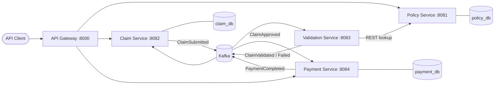

# Architecture

> Living document, updated at the end of every phase.
> Deeper reasoning: [System design](system-design.md) · [Database design](database-design.md) · [API design](api-design.md) · [Kafka events](kafka-events.md) · [Failure handling](failure-handling.md) · [SQL performance](sql-performance.md) · [ADRs](adr/README.md)

## Overview

ClaimFlow is a set of Spring Boot microservices behind an API gateway that model an insurance claim
from First Notice of Loss (FNOL) to closure. Services communicate synchronously over REST where an
immediate answer is needed, and asynchronously over Kafka for workflow steps.

## Components

| Component          | Port | Database     | Responsibility                                               | Guidewire analogue |
|--------------------|------|--------------|--------------------------------------------------------------|--------------------|
| api-gateway        | 8000 | none         | Single entry point: routing, correlation ID, 503/504 errors, JWT (Phase 7) | – |
| policy-service     | 8081 | `policy_db`  | Customers, policies, coverages, limits, deductibles          | PolicyCenter       |
| claim-service      | 8082 | `claim_db`   | FNOL, lifecycle state machine, adjusters, claim history      | ClaimCenter        |
| validation-service | 8083 | none         | Stateless rules: eligibility, coverage, dates, amounts (internal, not routed) | ClaimCenter rules |
| payment-service    | 8084 | `payment_db` | Settlement calculation, idempotent payments                  | BillingCenter      |
| common (library)   | –    | –            | Servlet-side correlation filter, error model, exception handling | –              |

## Gateway routes

| Path | Target |
|---|---|
| `/api/v1/policies/**`, `/api/v1/customers/**` | policy-service |
| `/api/v1/claims/**`, `/api/v1/adjusters/**` | claim-service |
| `/api/v1/payments/**` | payment-service |
| anything else | 404 |

Downstream unreachable → **503**, too slow (> 10 s) → **504**, both in the standard `ApiError` format.

## Key design decisions (summary)

| Decision | ADR |
|---|---|
| Microservices, database per service | [0002](adr/0002-microservices-with-database-per-service.md) |
| Kafka for async workflow (vs RabbitMQ / IBM MQ) | [0003](adr/0003-kafka-for-asynchronous-workflow.md) |
| REST for policy lookups | [0004](adr/0004-synchronous-rest-for-policy-lookup.md) |
| Flyway owns the schema, Hibernate validates | [0005](adr/0005-flyway-owns-schema.md) |
| Spring Cloud Gateway as the single entry point | [0006](adr/0006-api-gateway-with-spring-cloud-gateway.md) |
| Correlation ID from gateway to service to Kafka | [0007](adr/0007-correlation-id-propagation.md) |
| Policy expiry derived from dates, not stored | [0014](adr/0014-derive-policy-period-state-from-dates.md) |
| Standard MVC errors via `ResponseEntityExceptionHandler` | [0015](adr/0015-standard-mvc-errors-via-responseentityexceptionhandler.md) |
| Testcontainers for integration tests | [0016](adr/0016-testcontainers-for-integration-tests.md) |
| Claim lifecycle as an enum transition table with USER/SYSTEM triggers | [0008](adr/0008-claim-state-machine-as-domain-enum.md) |
| Idempotent FNOL (`Idempotency-Key`) | [0017](adr/0017-idempotent-fnol-with-idempotency-key.md) |
| Append-only claim history, same transaction | [0018](adr/0018-append-only-claim-history.md) |
| Transactional outbox for publishing | [0012](adr/0012-reliable-event-publishing.md) |
| Idempotent consumers (`processed_events`, ON CONFLICT) | [0009](adr/0009-idempotent-consumers-processed-events.md) |
| JSON envelope, String serde, no type headers | [0019](adr/0019-json-event-envelope.md) |
| Exact-decimal JSON | [0020](adr/0020-exact-decimal-json.md) |
| Deterministic event IDs (stateless idempotency) | [0021](adr/0021-deterministic-event-ids-for-stateless-idempotency.md) |
| Consumer failure classes: retry / long retry / DLT / ignore | [0022](adr/0022-classifying-consumer-failures.md) |
| No double payment: 3 guards + gateway idempotency key, bank call outside the tx | [0023](adr/0023-payment-idempotency-and-gateway-call-outside-transaction.md) |
| Outbox code copied, not shared (rule of three) | [0024](adr/0024-duplicate-outbox-code-rule-of-three.md) |
| Coverage terms carried in events | [0025](adr/0025-event-carried-coverage-terms.md) |
| Optimistic locking (409) + ETag/If-Match (412) | [0011](adr/0011-optimistic-locking-on-claims.md), [0026](adr/0026-conditional-updates-with-etag-if-match.md) |
| Composite index `(policy_id, status, created_at DESC)` | [0027](adr/0027-composite-index-claims-policy-status-created.md) |
| Layered non-root images from one Dockerfile | [0028](adr/0028-container-images.md) |
| CI: unit → integration → coverage → images | [0029](adr/0029-ci-pipeline.md) |
| BigDecimal for money | [0010](adr/0010-bigdecimal-for-money.md) |

## Cross-cutting concerns

- **Error format**: every service *and* the gateway return the same `ApiError` JSON:
  `timestamp, status, error, message, path, correlationId, violations`.
- **HTTP status mapping**: 400 validation, 404 not found, 409 conflict, 422 business rule,
  500 unexpected, 503/504 from the gateway.
- **Logging**: services prefix every line with `[service-name,correlationId]`; the gateway logs
  one access line per request with the ID and latency.

## Local ports

| Port | What |
|---|---|
| 8000 | API gateway (8080 is taken by a local Apache httpd) |
| 8081–8084 | services |
| 5433 | PostgreSQL (5432 is taken by a local PostgreSQL) |
| 9092 | Kafka |
| 8090 | Kafka UI |

In Docker (`--profile apps`) only the gateway (8000) is published; services talk over the compose
network by name (`policy-service:8081`, `postgres:5432`, `kafka:29092`).

## Change log

| Phase | Architecture changes |
|---|---|
| 1 | Module layout, database per service, Kafka/Postgres infra, common error handling and correlation ID, API gateway |
| 2 | Policy Service implemented (`policy_db` schema, 7 endpoints incl. `coverage-check`); `common` error handler rebuilt on `ResponseEntityExceptionHandler` |
| 3 | Claim Service implemented (`claim_db`, state machine, audit trail, idempotent FNOL, adjusters); `common` gains `ClockConfig`, `PageResponse`, method-validation errors |
| 8 | Containerised: one layered non-root Dockerfile, `docker compose --profile apps` runs all 5 services; GitHub Actions pipeline (unit → integration → coverage → images) |
| 7 | Lost-update protection: `@Version` → 409, ETag/If-Match → 412; composite index for the claims work-queue query, benchmarked with EXPLAIN ANALYZE on 500k rows and guarded by a plan test |
| 6 | Payment Service implemented: consumes `ClaimApproved`, BigDecimal settlement, idempotent payment via simulated gateway, publishes `PaymentInitiated`/`Completed`/`Failed` via outbox. **Full lifecycle runs end to end.** Claim Service stores coverage terms and forwards them in `ClaimApproved` |
| 5 | Validation Service implemented: consumes `ClaimSubmitted`, REST coverage-check to Policy Service, 5 pluggable rules, publishes validation results with deterministic IDs; dependency outages retried for minutes |
| 4 | Claim Service is event-driven: transactional outbox → `claim.events`; idempotent consumer of `validation.events` / `payment.events`; retry → DLT; correlation ID in Kafka headers; `common` gains the event contract, Kafka setup and money-safe JSON |
