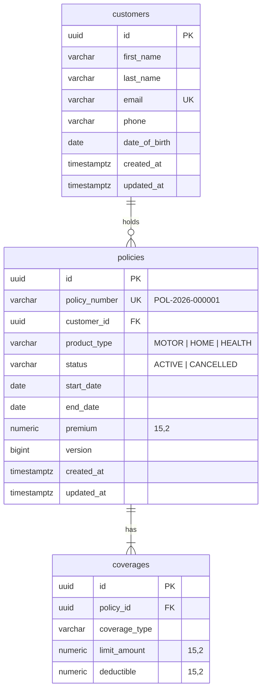
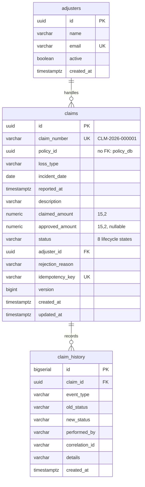

# Database Design

> Living document, one section per service, filled in as each service is built.
> Principles: database per service ([ADR-0002](adr/0002-microservices-with-database-per-service.md)),
> Flyway-owned schema ([ADR-0005](adr/0005-flyway-owns-schema.md)), money as `NUMERIC(15,2)`
> ([ADR-0010](adr/0010-bigdecimal-for-money.md)).

## Conventions

| Convention | Why |
|---|---|
| `UUID` primary keys generated in Java | IDs are known before insert; no sequence round-trip; safe to expose in URLs and events |
| `TIMESTAMPTZ` for instants, `DATE` for business dates | Policy periods and incident dates are calendar dates, not points in time |
| Enums stored as `VARCHAR` + `CHECK` constraint | Readable in SQL; reordering the Java enum can't corrupt data (never `ORDINAL`) |
| Constraints mirror API validation | The DB is the last line of defence if a bug or another path bypasses the service |
| Explicit indexes on FK columns used in lookups | PostgreSQL does **not** index foreign keys automatically |
| `version BIGINT` on aggregates that are updated | JPA optimistic locking |

---

## policy_db (Policy Service): Phase 2

### Constraints

| Constraint | Rule |
|---|---|
| `uk_customers_email` | one customer per email (stored lower-case) |
| `uk_policies_policy_number` | policy numbers are unique |
| `ck_policies_dates` | `end_date > start_date` |
| `ck_policies_premium` | `premium > 0` |
| `ck_policies_product`, `ck_policies_status` | allowed enum values |
| `uk_coverages_policy_type` | one coverage of each type per policy |
| `ck_coverages_limit`, `ck_coverages_deductible` | `limit > 0`, `0 ≤ deductible < limit` |
| `coverages.policy_id … ON DELETE CASCADE` | coverages belong to their policy |

### Indexes

| Index | Serves |
|---|---|
| `idx_policies_customer_id` | `GET /customers/{id}/policies` |
| `uk_coverages_policy_type (policy_id, coverage_type)` | joining coverages by `policy_id` (leading column); no separate index needed |

### Sequence

`policy_number_seq` feeds `POL-<year>-<6 digits>`. A sequence is atomic, so concurrent inserts never
collide. Gaps (from rolled-back transactions) are acceptable for a reference number.

### Query behaviour (verified)

| Endpoint | SQL statements |
|---|---|
| `GET /policies/{id}` | 1 (policies ⟕ coverages ⟕ customers via `@EntityGraph`) |
| `GET /customers/{id}/policies` | 2 (customer exists check + one join query), constant regardless of policy count |

---

## claim_db (Claim Service): Phase 3

### Constraints

| Constraint | Rule |
|---|---|
| `uk_claims_claim_number` | claim numbers are unique |
| `uk_claims_idempotency_key` | one claim per client idempotency key (NULLs allowed, many) |
| `ck_claims_claimed_amount` | `claimed_amount > 0` |
| `ck_claims_approved_amount` | `approved_amount` is NULL or `0 < approved_amount <= claimed_amount` |
| `ck_claims_status` | one of the 8 lifecycle states |
| `claims.adjuster_id → adjusters` | FK inside the same service is fine |
| `claims.policy_id` | **no FK**: the policy is in another service's database |

### Indexes

| Index | Serves |
|---|---|
| `idx_claims_adjuster_id` | adjuster workload lookups |
| `idx_claim_history_claim_created (claim_id, created_at, id)` | `GET /claims/{id}/history` in order |
| *(Phase 7)* `idx_claim_policy_status_created (policy_id, status, created_at DESC)` | `GET /claims?policyId=&status=`, added with EXPLAIN ANALYZE before/after |

### Messaging tables (Phase 4, `V2__outbox_and_processed_events.sql`)

| Table | Purpose | Key points |
|---|---|---|
| `outbox_events` | events waiting to be published ([ADR-0012](adr/0012-reliable-event-publishing.md)) | `id` = eventId; `seq BIGSERIAL` gives publish order; `payload` = full JSON envelope; `attempts`, `last_error` for visibility |
| `processed_events` | events already consumed ([ADR-0009](adr/0009-idempotent-consumers-processed-events.md)) | PK `(event_id, consumer_name)`; written with `INSERT … ON CONFLICT DO NOTHING` |

| Index | Serves |
|---|---|
| `idx_outbox_unpublished (seq) WHERE published_at IS NULL` | the relay's `SELECT … ORDER BY seq LIMIT n FOR UPDATE SKIP LOCKED`; a **partial** index stays tiny as published rows accumulate |

### Audit trail

`claim_history` is append-only (`@Immutable`, columns `updatable = false`) and written in the same
transaction as the claim change ([ADR-0018](adr/0018-append-only-claim-history.md)).

---

## payment_db (Payment Service): Phase 6

*To be designed.*
