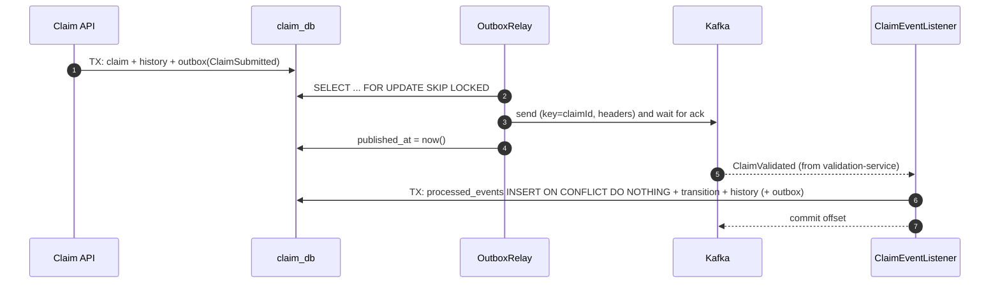

# Kafka Events

> Living catalogue of every event in ClaimFlow. Contract rules: [ADR-0019](adr/0019-json-event-envelope.md).

## Topics

| Topic | Producer | Consumers (group) | Key | Partitions |
|---|---|---|---|---|
| `claim.events` | claim-service (via outbox) | validation-service (`validation-service`, uses `ClaimSubmitted`), payment-service (`payment-service`, uses `ClaimApproved`) | claimId | 3 |
| `validation.events` | validation-service | claim-service (`claim-service`) | claimId | 3 |
| `payment.events` | payment-service (via outbox) | claim-service (`claim-service`) | claimId | 3 |
| `<topic>.DLT` | Spring Kafka `DeadLetterPublishingRecoverer` | humans / replay tooling | original key | 3 |

**Key = claimId**, so all events of one claim land on the same partition and are consumed **in order**.
Different claims are processed in parallel across partitions.

## Envelope

Every message value is this JSON (`common/.../events/EventEnvelope.java`):

```json
{
  "eventId": "367eaaf2-0843-47c6-9afc-25396887fbca",
  "eventType": "ClaimSubmitted",
  "version": 1,
  "occurredAt": "2026-09-27T09:09:36.053971800Z",
  "source": "claim-service",
  "aggregateId": "e29b7a92-8494-4e8a-afc3-3926b0187cd4",
  "correlationId": "demo-p4",
  "payload": { "claimId": "e29b...", "claimNumber": "CLM-2026-000002", "policyId": "d265...",
               "lossType": "COLLISION", "incidentDate": "2026-03-10", "claimedAmount": 200000.00 }
}
```

| Header | Value |
|---|---|
| `X-Correlation-ID` | same as the HTTP header; restored into the consumer's MDC |
| `eventType` | lets tools filter without parsing the body |
| `eventId` | same as the envelope's |

Amounts are plain decimals with their scale preserved (`200000.00`, never `2E+5`); see ADR-0020.

## Event catalogue

### claim.events (producer: claim-service)

| Event | When | Payload |
|---|---|---|
| `ClaimSubmitted` | FNOL accepted | `claimId, claimNumber, policyId, lossType, incidentDate, claimedAmount` |
| `ClaimApproved` | adjuster approves (claim → SETTLEMENT_PENDING) | `claimId, claimNumber, policyId, lossType, incidentDate, claimedAmount, approvedAmount, coverageLimit, deductible` (terms added in Phase 6, ADR-0025) |
| `ClaimRejected` | validation failed, or adjuster rejects | `claimId, claimNumber, reason` |
| `ClaimClosed` | claim closed | `claimId, claimNumber` |

### validation.events (producer: validation-service)

| Event | Effect in claim-service | Payload |
|---|---|---|
| `ClaimValidated` | SUBMITTED → UNDER_REVIEW | `claimId, coverageLimit, deductible, warnings[]` (`warnings` added in Phase 5, optional) |
| `ClaimValidationFailed` | SUBMITTED → REJECTED (+ `ClaimRejected` published) | `claimId, reasons[]` (all failed rules) |

Validation result `eventId`s are **derived** from the `ClaimSubmitted` eventId (ADR-0021). A result for
a claim that is no longer SUBMITTED is ignored as stale (ADR-0022).

### payment.events (producer: payment-service)

| Event | Effect in claim-service | Payload |
|---|---|---|
| `PaymentInitiated` | SETTLEMENT_PENDING → PAYMENT_INITIATED | `claimId, paymentId, amount` |
| `PaymentCompleted` | PAYMENT_INITIATED → SETTLED | `claimId, paymentId, amount` |
| `PaymentFailed` | no status change; `PAYMENT_FAILED` history row for manual review | `claimId, paymentId, reason` |

Unknown `eventType`s are logged and skipped (tolerant reader), so producers can add events first.

## End-to-end flow



## Delivery guarantees

| Hop | Guarantee | Mechanism |
|---|---|---|
| DB change → outbox | atomic | same transaction |
| outbox → Kafka | **at least once** | relay retries until the broker acks (`acks=all`, idempotent producer) |
| Kafka → consumer | **at least once** | offset committed after processing (`ack-mode: record`) |
| business effect | **effectively once** | `processed_events` dedupe by `eventId`, in the same transaction |

We don't claim Kafka "exactly-once" for business outcomes; see ADR-0009.
