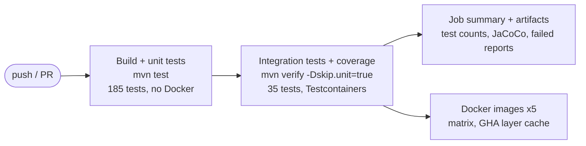

# Phase 8 — Docker and CI/CD

**Status:** ✅ Complete (the workflow file is validated locally; its first real run happens on the first push to GitHub)

## Goal

The pipeline from the spec: **Git push → Build → Unit tests → Integration tests → Quality checks →
Docker build → Image**, plus a one-command way to run the whole platform locally.

## Delivered

| Item | Location |
|---|---|
| Unit / integration split: Surefire runs everything except `*IntegrationTest` (`mvn test`); Failsafe runs `*IntegrationTest` (`mvn verify`); `-Dskip.unit=true` avoids running unit tests twice | parent `pom.xml` |
| JaCoCo coverage: agent for both phases, merged report at `verify` | parent `pom.xml` |
| One multi-stage Dockerfile for all services (`--build-arg MODULE=...`), layered jar, JRE Alpine, non-root, container-aware heap | `Dockerfile`, `.dockerignore` |
| `docker compose --profile apps up`: 5 services + infra, healthchecks, `depends_on: service_healthy`, only the gateway published | `docker-compose.yml` |
| GitHub Actions: build + unit → integration + coverage → test summary → artifacts → Docker image matrix (after tests pass) | `.github/workflows/ci.yml` |

## Pipeline

## Image design

| Choice | Why |
|---|---|
| Multi-stage (Maven JDK → JRE) | build tools never reach production; smaller attack surface |
| **Layered jar** (`-Djarmode=tools extract --layers`) | dependencies (rarely change) in lower layers; our code (**177 kB**) on top. A code change rebuilds and pushes only that layer |
| Poms copied before sources + BuildKit cache mount for `~/.m2` | dependency download cached; rebuilds took 2–15 s after the first |
| `eclipse-temurin:17-jre-alpine` | Java 17 runtime (the project target); Alpine includes `wget` for healthchecks |
| Non-root user `claimflow` (uid 100) | a compromised app doesn't run as root in the container |
| `-XX:MaxRAMPercentage=75` | heap sized from the container's memory limit, not the host's |
| `-XX:+ExitOnOutOfMemoryError` | crash and let the orchestrator restart, instead of limping on |

Image sizes: 221–260 MB (JRE ≈ 170 MB of that).

## Verification

| Check | Result |
|---|---|
| `mvn test` | ✅ 185 unit tests, 46 s, no Docker |
| `mvn verify -Dskip.unit=true` | ✅ unit tests skipped, 35 integration tests run |
| Coverage (unit + integration merged) | policy 95 %, claim 93 %, validation 97 %, payment 91 % of instructions. `common` shows 11 % because its code is exercised by the *services'* tests; a cross-module aggregate report would credit it |
| All 5 images build; run as `uid=100(claimflow)` | ✅ |
| `docker compose --profile apps up -d --wait` | ✅ 8 containers healthy in 47 s |
| **Full journey in containers:** new customer → HOME/FIRE policy → FNOL → auto-validated → approved 3,00,000 → paid **2,75,000.00** (25,000 deductible) | ✅ |
| Correlation ID `docker-journey` in gateway, claim and validation container logs | ✅ |
| Workflow YAML parses; the job-summary script run locally gives the right counts (5 / 30+4 / 110+17 / 26+7 / 14+7) | ✅ |
| **GitHub Actions run itself** | ⏳ happens on the first push (can't be executed locally) |

## Issues found & fixed

- **BUG-015: healthchecks would never have passed.** The compose healthcheck probed `$PORT`, which
  wasn't set in the containers, so every check would hit port 8080 while services listen on
  8081–8084/8000. Caught while reviewing the file before the first `up`; `PORT` is now set per service.
- **BUG-016: stale test reports gave wrong counts.** The job-summary script counted unit tests from
  `surefire-reports`, which still held XML from before the unit/integration split, so the counts
  were too high (34 vs 30 for policy). CI always starts from a clean checkout, but I verified with
  cleaned report folders before trusting the script.

## Decisions

- [ADR-0028](../adr/0028-container-images.md): one parameterised, layered, non-root Dockerfile (new)
- [ADR-0029](../adr/0029-ci-pipeline.md): CI stages, unit/integration split, images only after green tests (new)

## Deferred

- Pushing images to a registry (GHCR) on `main`: documented in the workflow; needs `packages: write`.
- Coverage threshold gate and a cross-module coverage aggregate.
- Static analysis (SpotBugs/Checkstyle/Sonar), dependency vulnerability scan (OWASP / Trivy for images).
- Deployment (Kubernetes manifests / Helm): out of scope per the spec.
