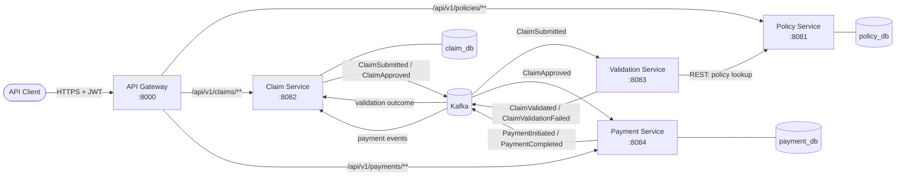
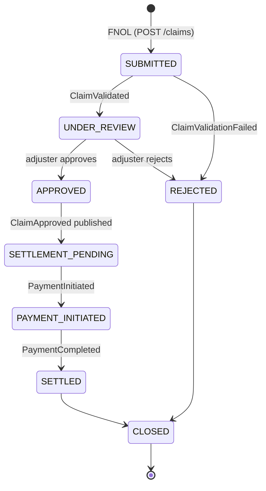
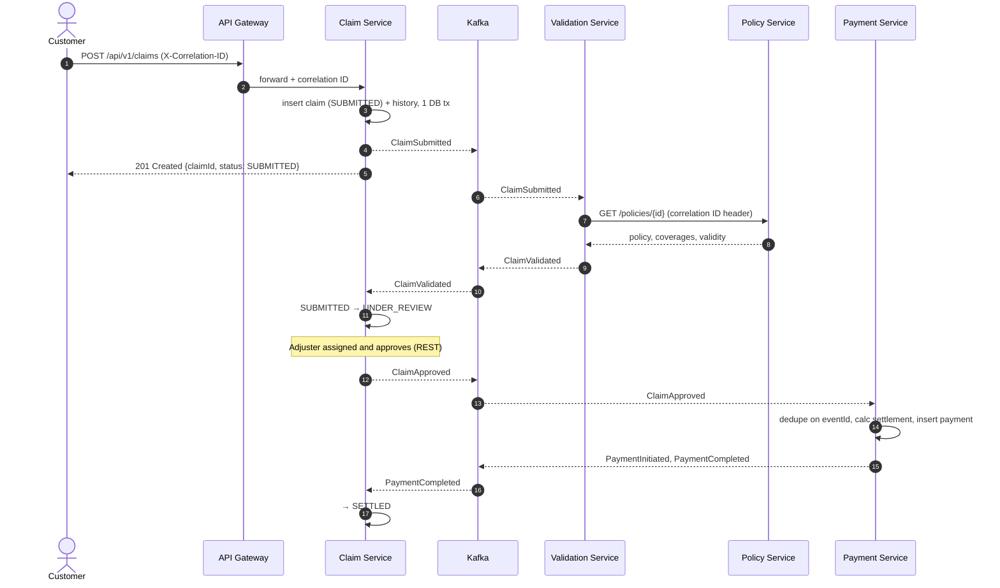
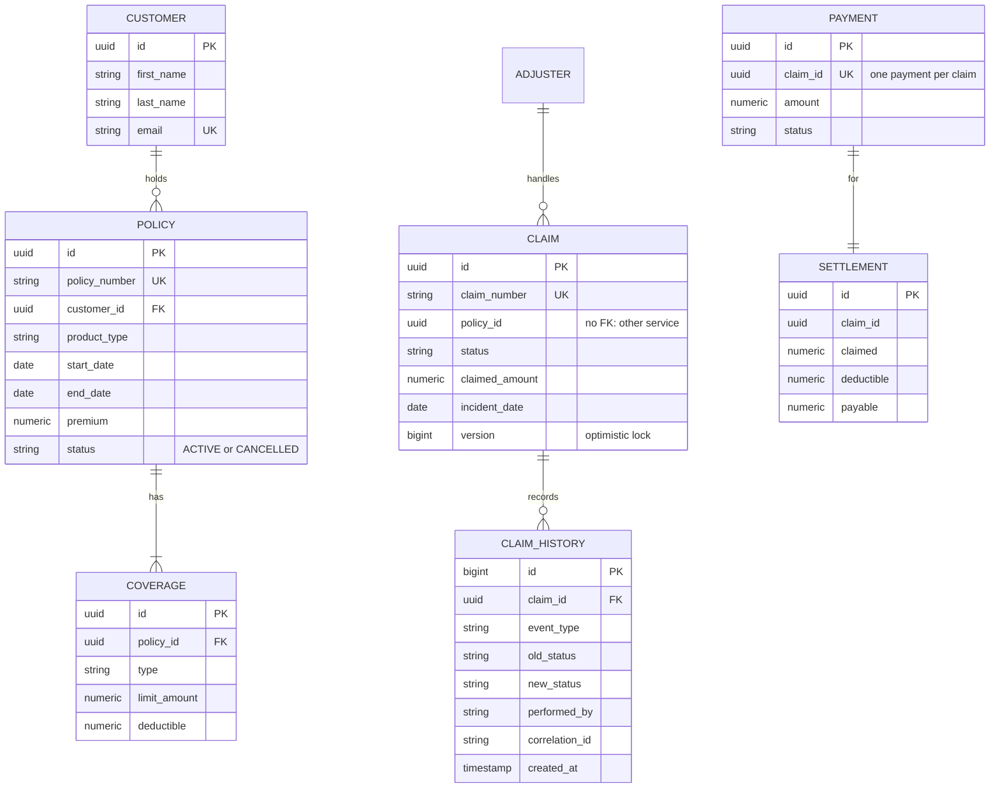

# System Design — ClaimFlow

> Living document. Sections marked *(planned — Phase N)* describe the target design and are
> filled in with implementation detail when that phase is delivered.

## 1. Problem statement

An insurer needs to take a claim from **First Notice of Loss (FNOL)** to **closure**: check the claim
against the customer's policy, let an adjuster review it, calculate the settlement, pay exactly once,
and keep a complete audit trail. Several teams own different parts of the flow (policy administration,
claims handling, billing/payments), mirroring Guidewire PolicyCenter, ClaimCenter and BillingCenter.

## 2. Requirements

### 2.1 Functional

| # | Requirement |
|---|---|
| F1 | Create and read customers, policies and coverages (limit, deductible, validity period). |
| F2 | Submit a claim (FNOL) against a policy. |
| F3 | Automatically validate a submitted claim: policy active on incident date, coverage exists, amount sensible. |
| F4 | Assign an adjuster; adjuster approves or rejects. |
| F5 | Calculate settlement = min(claim amount − deductible, remaining coverage limit). |
| F6 | Initiate and complete payment **exactly once per claim** (business-level). |
| F7 | Enforce the claim lifecycle; reject invalid transitions (e.g. `CLOSED → APPROVED`). |
| F8 | Record every state change in an audit history (who, what, when, old → new status, correlation ID). |
| F9 | Notify the customer on key events (simulated email/SMS). |

### 2.2 Non-functional

| Quality | Target / approach |
|---|---|
| **Correctness of money** | `BigDecimal`, `NUMERIC(15,2)`; no floating point. No duplicate payments under retries or redelivery. |
| **Reliability** | A service outage must not lose a claim; async steps resume when the service recovers (Kafka retention + consumer offsets). |
| **Consistency** | Strong consistency *inside* a service (ACID transaction); eventual consistency *across* services (events). |
| **Concurrency** | Two users editing the same claim must not silently overwrite each other (optimistic locking → 409). |
| **Traceability** | Any request/claim can be traced across all services by one correlation ID. |
| **Auditability** | Append-only claim history; never updated or deleted. |
| **Security** | Single authenticated entry point; role-based access (CUSTOMER, ADJUSTER, CLAIMS_MANAGER, ADMIN). |
| **Maintainability** | Versioned schema migrations, uniform error model, tests at unit + integration level, CI on every push. |
| **Latency** | Synchronous APIs p95 < 300 ms locally; claim validation completes asynchronously within seconds. |

### 2.3 Out of scope

Real payment gateway, real SMS/email provider, ML fraud detection, UI dashboard, Kubernetes.

## 3. Capacity estimate (order of magnitude)

Assume a mid-size insurer: 1 M active policies, ~5% claim rate per year → **~50 k claims/year**
(~140/day, peaks of maybe 10×/day after a storm → ~1,400/day).
Each claim produces ~8 events → ~11 k events/day at peak, i.e. **well under 1 event/second**.

**Conclusion:** load is modest; the design is driven by **correctness, auditability and decoupling**,
not raw throughput. A single Kafka broker and one Postgres instance per service are ample; partitions
(3 per topic) exist for ordering-by-claim and future horizontal scaling, not current load.

## 4. High-level architecture



| Component | Responsibility | State |
|---|---|---|
| **API Gateway** | Single entry point: routing, correlation ID assignment, uniform 503/504, JWT validation *(Phase 7)* | stateless |
| **Policy Service** | Customers, policies, coverages; answers "is policy X active and covering Y on date D?" | `policy_db` |
| **Claim Service** | FNOL, lifecycle state machine, adjuster assignment, claim history — **owner of claim status** | `claim_db` |
| **Validation Service** | Stateless rules engine triggered by `ClaimSubmitted`; asks Policy Service `coverage-check` | none |
| **Payment Service** | Settlement calculation, payment lifecycle, duplicate-payment prevention | `payment_db` |
| **Notification consumer** | Listens to claim/payment events and logs simulated notifications | none |

## 5. Claim lifecycle



The Claim Service is the **single writer** of claim status. Other services never change it directly;
they publish events and the Claim Service applies the transition if the state machine allows it.
Every transition is marked **USER** (adjuster/manager via REST: approve, reject after review, close)
or **SYSTEM** (driven by events: validation outcome, settlement and payment steps). Invalid
transitions return `409 Conflict`; a user requesting a SYSTEM transition returns `422`. Implemented in
Phase 3 ([ADR-0008](adr/0008-claim-state-machine-as-domain-enum.md)); full table in
[phase-03-claim-service.md](phases/phase-03-claim-service.md).

## 6. Key flows

### 6.1 Happy path: FNOL → payment



The customer gets `201` immediately after FNOL. Validation, which depends on another service,
happens asynchronously, so a slow or down Policy Service never blocks claim intake.

### 6.2 Duplicate event (idempotent consumer) *(planned — Phase 4)*

```mermaid
sequenceDiagram
    participant K as Kafka
    participant PAY as Payment Service
    participant DB as payment_db
    K-->>PAY: ClaimApproved (eventId=E1)
    PAY->>DB: BEGIN; INSERT processed_events(E1); INSERT payment; COMMIT
    Note over PAY,K: consumer crashes before committing the offset
    K-->>PAY: ClaimApproved (eventId=E1) redelivered
    PAY->>DB: INSERT processed_events(E1) → unique violation
    PAY->>PAY: already processed → skip, ack offset
```

The dedupe record and the business write share **one DB transaction**, so either both happen or
neither does. As a second guard, `payments.claim_id` has a **unique constraint**: one payment per claim
even if two different events arrived.

## 7. Data design

> Implemented schemas, constraints and indexes: [database-design.md](database-design.md). Full API detail: [api-design.md](api-design.md).

Each service owns its database; no foreign keys cross service boundaries (IDs are just values).



Plus a `processed_events(event_id PK, consumer_name, processed_at)` table in every consuming service.

| Service | Tables |
|---|---|
| policy-service | `customers`, `policies`, `coverages` |
| claim-service | `claims`, `claim_history`, `adjusters`, `processed_events` |
| payment-service | `payments`, `settlements`, `processed_events` |

**Indexing** *(detailed in Phase 7)*: `claims(policy_id, status, created_at DESC)` for the
"claims for a policy by status, newest first" query; verified with `EXPLAIN ANALYZE`.

## 8. API design

- Versioned paths `/api/v1/...`, nouns for resources, verbs only for actions (`/assign-adjuster`).
- `POST` → `201 Created` + `Location` header; `PATCH /claims/{id}/status` for transitions.
- Uniform error body (`ApiError`) from every service and the gateway.

| Operation | Endpoint |
|---|---|
| Create / get customer | `POST /api/v1/customers`, `GET /api/v1/customers/{customerId}` |
| Create / get policy | `POST /api/v1/policies`, `GET /api/v1/policies/{policyId}` |
| Customer's policies | `GET /api/v1/customers/{customerId}/policies` |
| Cancel policy | `POST /api/v1/policies/{policyId}/cancel` |
| Coverage check (for Validation) | `GET /api/v1/policies/{policyId}/coverage-check?coverageType=&incidentDate=` |
| Submit / get claim | `POST /api/v1/claims` (+ `Idempotency-Key`), `GET /api/v1/claims/{claimId}` |
| Claims of a policy | `GET /api/v1/claims?policyId=&status=&page=&size=` |
| Adjusters | `POST /api/v1/adjusters`, `GET /api/v1/adjusters` |
| Update claim status | `PATCH /api/v1/claims/{claimId}/status` |
| Assign adjuster | `POST /api/v1/claims/{claimId}/assign-adjuster` |
| Claim history | `GET /api/v1/claims/{claimId}/history` |

## 9. Event design *(planned — Phase 4)*

| Topic | Key | Producer | Consumers |
|---|---|---|---|
| `claim.events` | claimId | claim-service | validation, payment, notification |
| `validation.events` | claimId | validation-service | claim-service |
| `payment.events` | claimId | payment-service | claim-service, notification |

- **Key = claimId**, so all events for one claim go to the same partition and stay **in order**.
- **Envelope:** `eventId (UUID), eventType, occurredAt, correlationId, payload`. `eventId` drives idempotency.
- Correlation ID also travels as a Kafka **header**, so consumers restore it into their MDC.
- **At-least-once delivery** (commit the offset after processing) plus an **idempotent consumer**
  gives **effectively-once business processing**. Kafka itself doesn't guarantee exactly-once
  business outcomes across a DB and a topic.
- Failures: retry with backoff, then send to a **Dead Letter Topic** (`<topic>.DLT`) for inspection.

## 10. Consistency and failure handling

| Failure | Behaviour |
|---|---|
| Downstream service down (sync call via gateway) | Gateway returns **503** in the standard error format; client may retry. |
| Downstream too slow | Gateway returns **504** after the 10 s response timeout. |
| Client retries FNOL after a timeout | Same `Idempotency-Key` returns the original claim (200); concurrent retries resolve to one claim via a unique constraint (ADR-0017). |
| Policy Service down during FNOL | FNOL is still accepted (`SUBMITTED`); the policy is checked asynchronously. |
| Policy Service down during validation | Consumer retries with backoff; the event stays in Kafka; the claim waits in `SUBMITTED`. |
| Consumer crashes mid-processing | Offset not committed, so the event is redelivered and the idempotency check prevents double effects. |
| Poison message (always fails) | After N retries it goes to the DLT; the consumer moves on and the partition doesn't block. |
| Concurrent claim update | `@Version` optimistic lock returns **409**; the client reloads and retries. |
| Payment fails | Payment row kept as `FAILED`, retryable, visible for manual review; claim stays `PAYMENT_INITIATED`. |
| DB commit succeeds but event publish fails (dual write) | See ADR-0012: transactional outbox considered; decision recorded in Phase 4. |

## 11. Security *(planned — Phase 7)*

- The gateway validates the JWT (signature, expiry) and rejects anonymous calls with 401.
- Services enforce roles with method security (`@PreAuthorize`), e.g. only `ADJUSTER` or
  `CLAIMS_MANAGER` can approve. A valid token without the role gets 403.
- Validation Service isn't routed through the gateway at all (internal only).

## 12. Observability

- **Correlation ID** assigned at the gateway and propagated over HTTP headers, into the MDC in each
  service, and into Kafka headers.
- Actuator `/health` on every service (used by Docker healthchecks).
- Structured audit history per claim answers "what happened to claim X and who did it".
- *Future:* Micrometer metrics plus Prometheus/Grafana; OpenTelemetry tracing (replaces the hand-rolled correlation ID).

## 13. Scalability path (if load grew 100×)

1. Scale services horizontally, since they're stateless apart from the DB; the gateway load-balances.
2. Increase topic partitions; consumer-group instances scale up to the partition count.
3. Read replicas for Policy Service, because lookups dominate.
4. Cache hot policy lookups (short TTL) in Validation Service.
5. Partition or archive `claim_history` by date.

## 14. Trade-offs accepted

| Choice | Cost we accept |
|---|---|
| Microservices | Operational complexity, eventual consistency, distributed debugging. Justified here by the natural product boundaries and the learning goal. |
| Async validation | The client doesn't get the validation result in the FNOL response; it polls `GET /claims/{id}` or gets notified. |
| Single Postgres server locally | Not production isolation, but database-per-service boundaries are still enforced. |
| Hand-rolled correlation ID | Less capable than OpenTelemetry, but transparent and easy to explain. |

See [`adr/`](adr/) for the reasoning behind each major decision.
